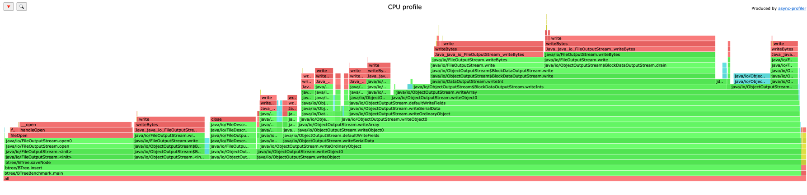
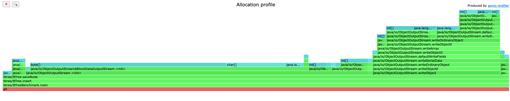

# B-tree-lab2
B-tree-lab2

B-дерево (B-tree) — это структура данных, которая используется для организации, поиска, вставки, удаления и последовательного доступа к данным. Она особенно полезна для работы с большими объемами данных, хранящимися на диске, таких как базы данных и файловые системы. B-дерево всегда остается сбалансированным, что обеспечивает логарифмическое время выполнения операций поиска, вставки и удаления.  

Оно состоит из узлов, каждый из которых может содержать несколько ключей и указателей на дочерние узлы, что позволяет эффективно использовать пространство на диске и минимизировать количество операций ввода-вывода. Каждый узел B-дерева имеет минимальную и максимальную степень, которые определяют, сколько ключей и дочерних узлов может содержать узел, что помогает поддерживать баланс дерева.  

B-дерево эффективно использует память, так как узлы могут содержать несколько ключей, что снижает количество узлов и, соответственно, количество операций ввода-вывода. Оно также поддерживает эффективный последовательный доступ к данным, что делает его полезным для приложений, требующих обхода данных в порядке ключей.

B-дерево (B-tree) специально разработано для эффективного использования внешней памяти, такой как диски, что делает его идеальным для приложений, работающих с большими объемами данных, которые не могут полностью поместиться в оперативную память. Вот как B-дерево использует внешнюю память:

B-дерево организовано таким образом, чтобы минимизировать количество операций ввода-вывода, которые являются самыми медленными операциями в системе. Это достигается за счет того, что каждый узел B-дерева может содержать несколько ключей и указателей на дочерние узлы. Это позволяет узлам быть достаточно большими, чтобы эффективно использовать пространство на диске и минимизировать количество операций чтения и записи.

Когда данные хранятся на диске, они обычно разбиваются на блоки фиксированного размера, называемые страницами. B-дерево организовано так, чтобы каждый узел соответствовал одной странице на диске. Это означает, что при доступе к узлу B-дерево читает или записывает целую страницу за одну операцию ввода-вывода. Таким образом, B-дерево минимизирует количество операций ввода-вывода, необходимых для выполнения операций поиска, вставки и удаления.

### CPU flamegraph.

CPU flamegraph при построении дерева.  
Основной процесс начинается с btree.BTreeExample.main, который вызывает методы btree.BTree.insert и btree.BTree.saveNode. Основное потребление CPU связано с методами java.io.ObjectOutputStream.writeObject, java.io.ObjectOutputStream.writeSerialData и java.io.ObjectOutputStream.writeArray, что указывает на высокую нагрузку из-за сериализации данных.

### Allocation flamegraph.

Allocation flamegraph при построении дерева.  "
Методы java.io.ObjectOutputStream занимают большую часть профиля, что указывает на высокую нагрузку при сериализации объектов. Это связано с тем, что методы btree.BTree.saveNode и btree.BTree.insert вызывают сериализацию

# Вывод

В ходе выполнения лабораторной работы по работе с внешней памятью в Java, мы исследовали структуру данных B-дерево (B-tree) и его применение для эффективного управления большими объемами данных, хранящимися на диске. B-дерево является сбалансированной структурой данных, которая обеспечивает логарифмическое время выполнения операций поиска, вставки и удаления, что делает его идеальным для использования в базах данных и файловых системах.